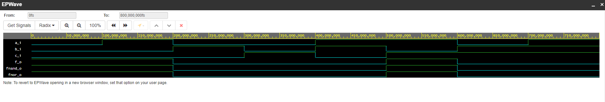

# Cvičení první
## Odkaz na playground
### de morgan laws
https://www.edaplayground.com/x/umsg
### druha čast
### Kod pro de morganovy zakony
```vhdl
-- Code your design here
library IEEE;
use IEEE.std_logic_1164.all;
entity gates is
	port(
    	a_i	: in std_logic;
        b_i	: in std_logic;
        c_i : in std_logic;
        fnand_o	: out std_logic;
       -- fand_o	: out std_logic;
      	fnor_o	: out std_logic;
        f_o : out std_logic
    	);
    end entity gates;
    architecture dataflow of gates is
    begin
   -- for_o <= a_i or b_i;
   -- fand_o <= a_i and b_i;
    --fxor_o <= a_i xor b_i;
    f_o<= ((not b_i) and a_i) or ((not c_i) and (not b_i));
    fnand_o <= not (not (not b_i and a_i) and not(not b_i and not c_i));
    fnor_o <= (not(b_i or (not a_i))) or(not(c_i or b_i));
    end architecture dataflow;
```
## Screen simulace


### Kod pro druhou čast
    