# 03-vivado
## Architecture of design
```vhdl
architecture Behavioral of mux_2bit_4to1 is
    begin
    f_o <= a_i when (sel_i ="00") else
    b_i when (sel_i ="00") else
    c_i when (sel_i ="00") else
    d_i;
    
   
  
 
    end architecture Behavioral;
```
## stimulus proccess
```vhdl
 beginning of stimulus process
        report "Stimulus process started" severity note;


        -- First test values
        s_d <= "00"; s_c <= "00";s_b <= "00"; s_a <= "00" ;
        s_sel <="00";wait for 100ns;
 
        s_d <= "10"; s_c <= "01";s_b <= "01"; s_a <= "00" ;
        s_sel <="00";wait for 100ns;
        
        s_d <= "10"; s_c <= "01";s_b <= "01"; s_a <= "11" ;
        s_sel <="00";wait for 100ns;
        
        s_d <= "10"; s_c <= "01";s_b <= "01"; s_a <= "00" ;
        s_sel <="01";wait for 100ns;
        
        s_d <= "10"; s_c <= "01";s_b <= "11"; s_a <= "00" ;
        s_sel <="01";wait for 100ns;


        -- Report a note at the end of stimulus process
        report "Stimulus process finished" severity note;
        wait;
    end process p_stimulus;
```
## Screenshot simulace
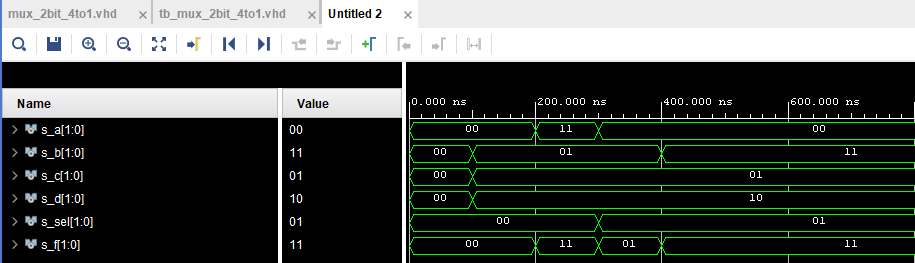
## Tutorial k Vivado
K založení nového projektu, potřeba kliknout v liště na File
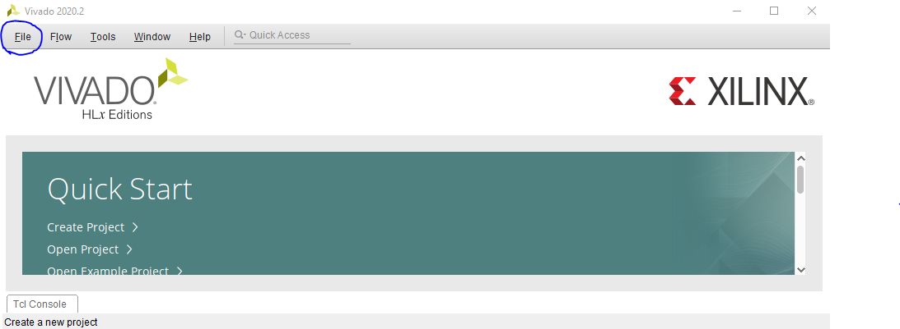
Následně Project -> New
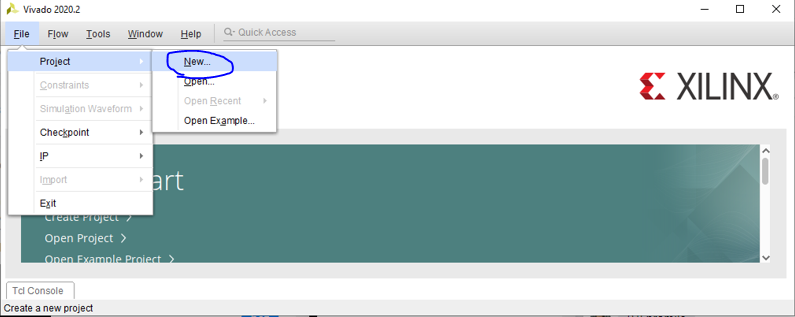
Klikneme na tlačítko Next
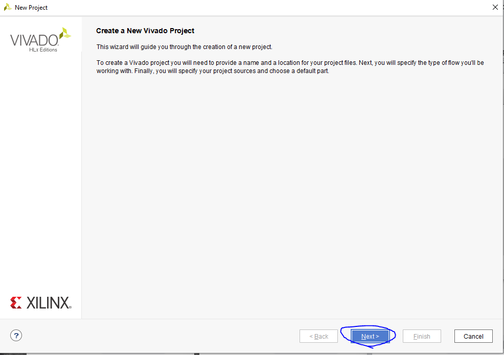
Zádname název projektu a cestu, kde se nám projekt uloží
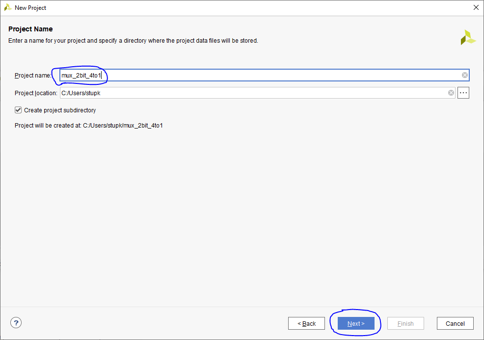
Necháme zaškrnuté políčko RTL Project a pokračujeme tlačítkem Next
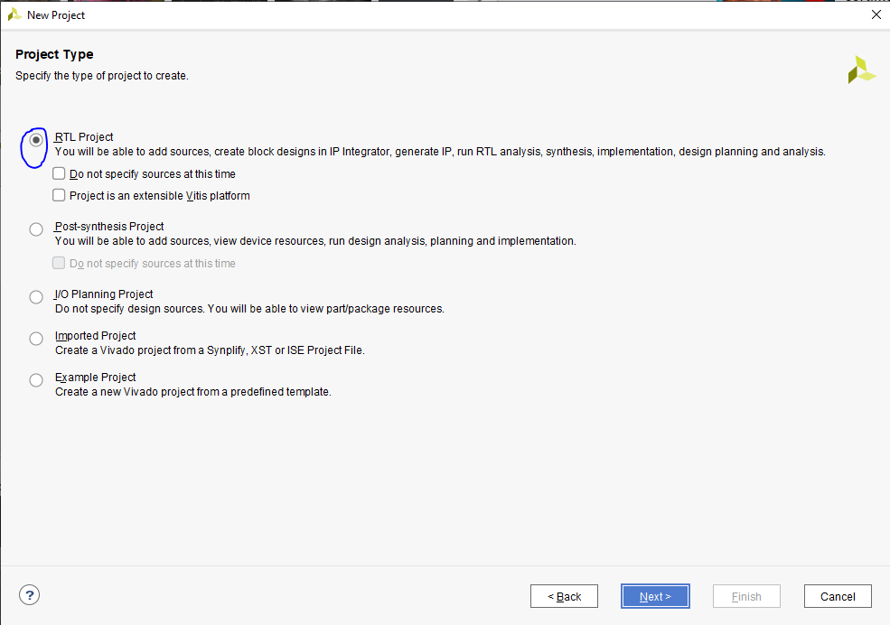
Zde klikneme na create File
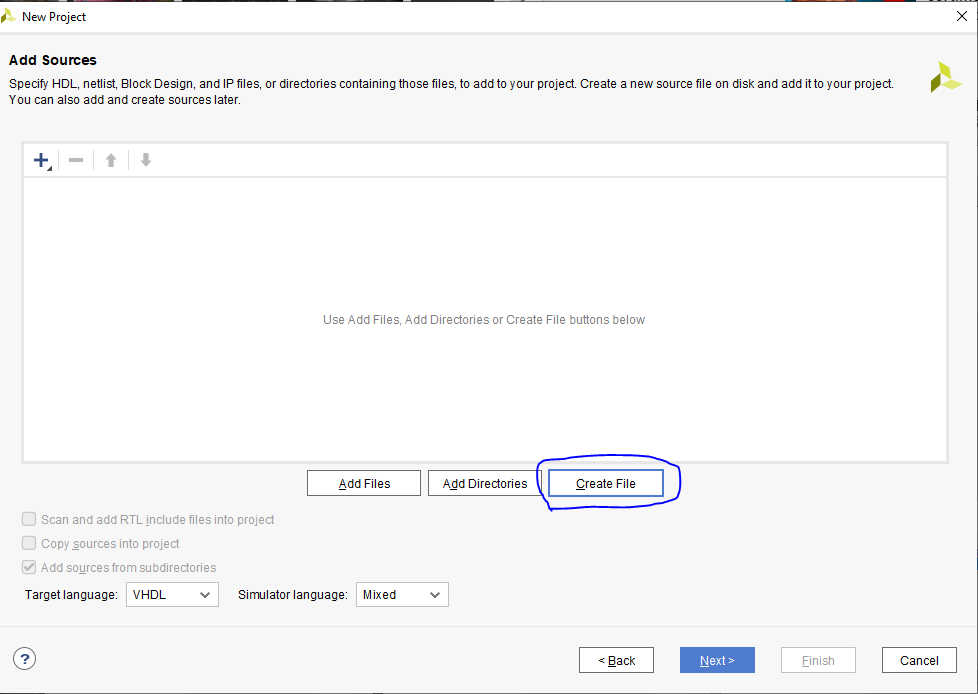
Zvolíme typ souboru VHDL a zadáme název a potvrdíme tlačítkem ok
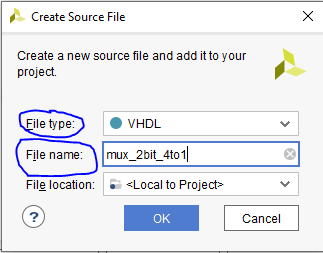
Zde zatím nic nepřidávame, tudíž odklikneme tlačítkem Next
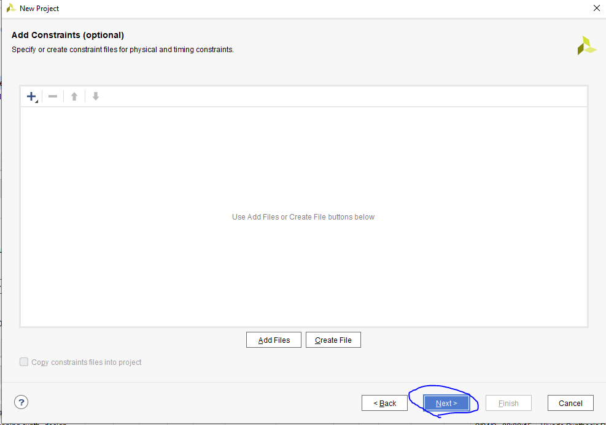
Zde zatím nic nepřidávame, tudíž odklikneme tlačítkem Next
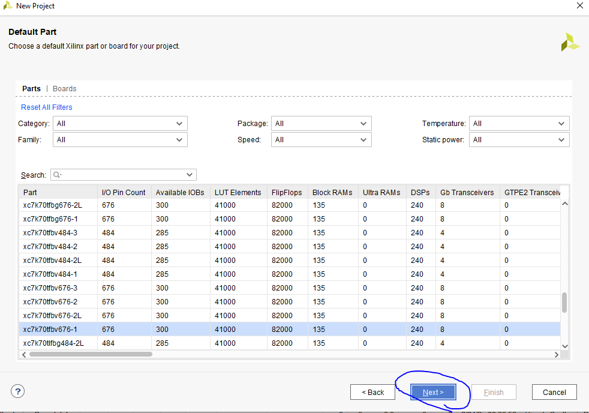
A Nakonec dáme Finish
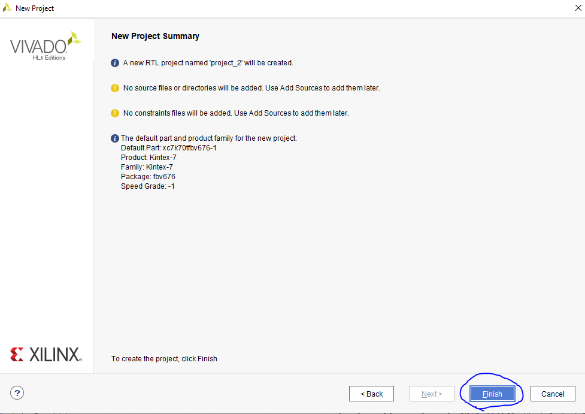
K otevření pracovního prostoru 2x poklikáme na název designu, ktery jsme si zvolili
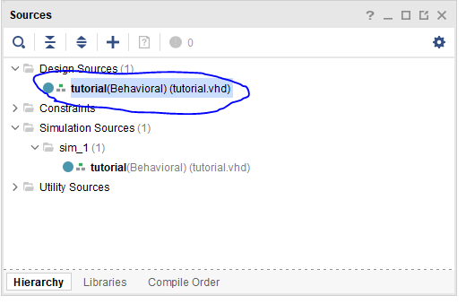
K přídání simulace nebo constrains slouží na levé straně tlačítko Add Sources

Vybere co chceme přidat a klikneme na Next
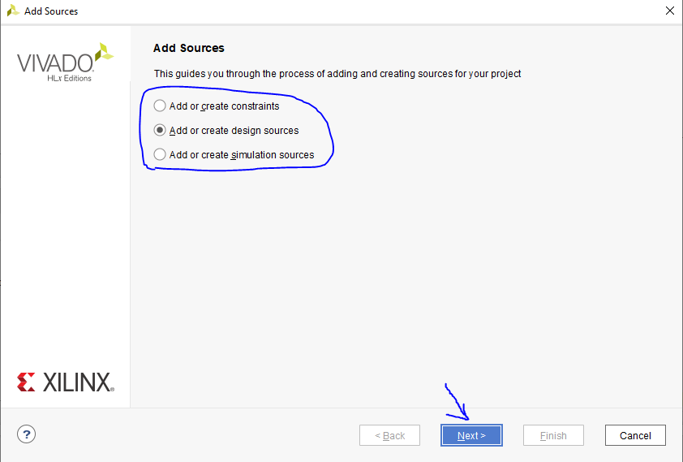
Klikneme na Create File
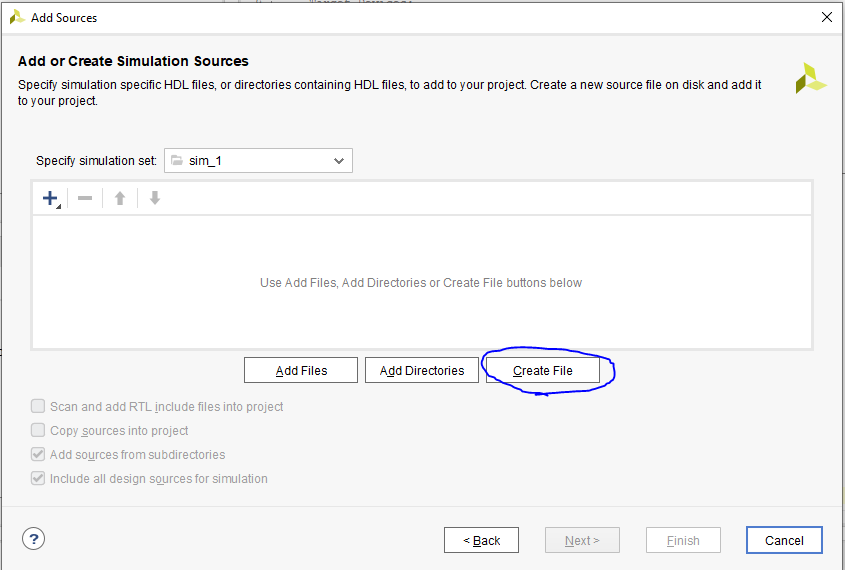
Zadáme opět Typ a jmeno souboru
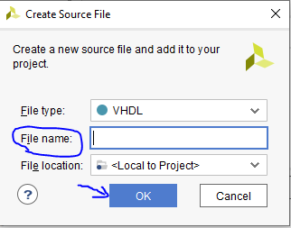
A dáme finish
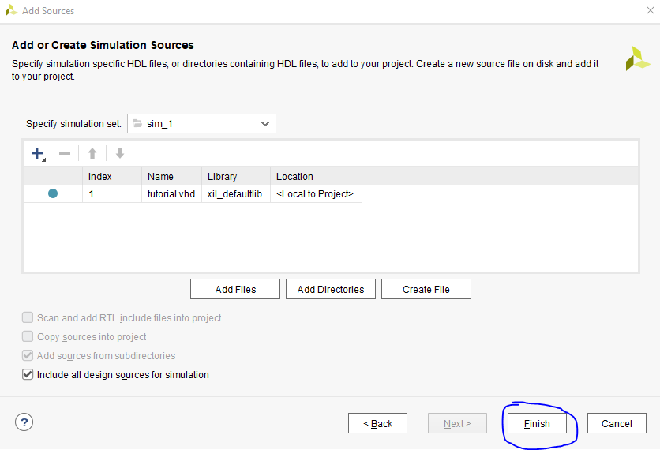
Potvrdíme tlačítkem OK
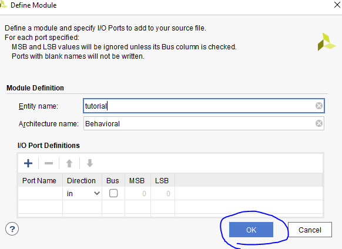
Simulaci spustíme opět na levě straně tlačítkem Start Simulation.