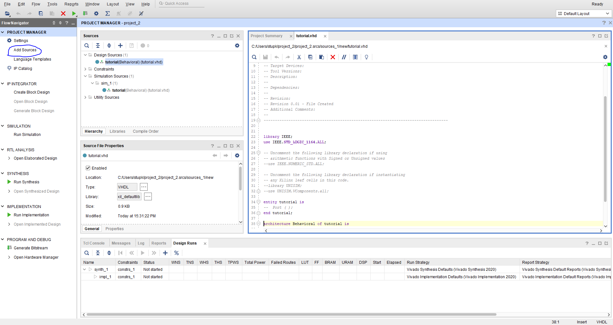

# 03-vivado
## Architecture of design
```vhdl
architecture Behavioral of mux_2bit_4to1 is
    begin
    f_o <= a_i when (sel_i ="00") else
    b_i when (sel_i ="00") else
    c_i when (sel_i ="00") else
    d_i;
    
   
  
 
    end architecture Behavioral;
```
## stimulus proccess
```vhdl
 p_stimulus : process
    begin
        -- Report a note at the begining of stimulus process
        report "Stimulus process started" severity note;


       s_d <= "00"; s_c <= "00"; s_b <= "00"; s_a <= "00";
       s_sel <="01"; wait for 100 ns;
       s_sel <="11"; wait for 100 ns;
       s_sel <="10"; wait for 100 ns;
         
        
        
        

        -- Report a note at the end of stimulus process
        report "Stimulus process finished" severity note;
        wait;
    end process p_stimulus;
```
## Screenshot simulace

## Tutorial k Vivado





