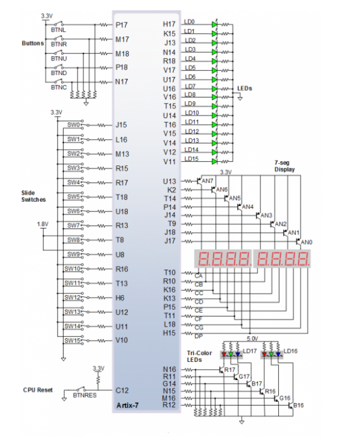
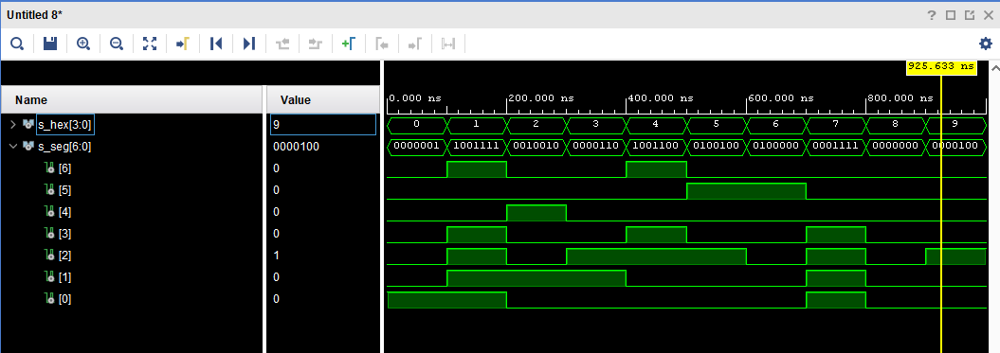
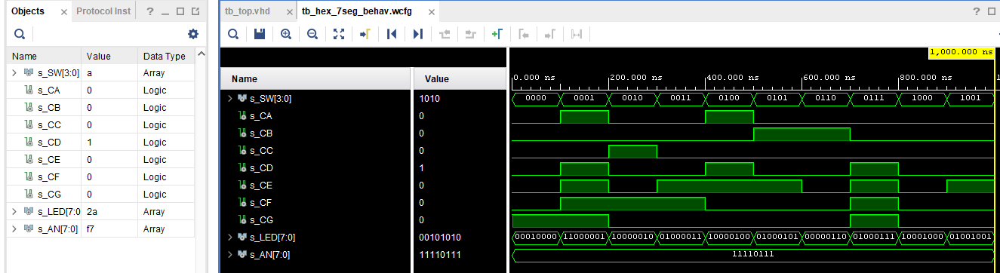

# 04-Segment
## 1. Preparation tasks (done before the lab at home). Submit

### Figure or table with connection of 7-segment displays on Nexys A7 board
### Decoder truth table for common anode 7-segment display.
| Hex | Inputs | A | B | C | D | E | F | G |
| :-: | :-: | :-: | :-: | :-: | :-: | :-: | :-: | :-: |
| 0 | 0000 | 0 | 0 | 0 | 0 | 0 | 0 | 1 |
| 1 | 0001 | 1 | 0 | 0 | 1 | 1 | 1 | 1 |
| 2 | 0010 | 0 | 0 | 1 | 0 | 0 | 1 | 0 |
| 3 | 0011 | 0 | 0 | 0 | 0 | 1 | 1 | 0 |
| 4 | 0100 | 1 | 0 | 0 | 1 | 1 | 0 | 0 | 
| 5 | 0101 | 0 | 1 | 0 | 0 | 1 | 0 | 0 |
| 6 | 0110 | 0 | 1 | 0 | 0 | 0 | 0 | 0 |
| 7 | 0111 | 0 | 0 | 1 | 1 | 1 | 1 | 1 |
| 8 | 1000 | 0 | 0 | 0 | 0 | 0 | 0 | 0 |
| 9 | 1001 | 0 | 0 | 0 | 0 | 1 | 0 | 0 |
| A | 1010 | 0 | 0 | 0 | 1 | 0 | 0 | 0 |
| b | 1011 | 1 | 1 | 0 | 0 | 0 | 0 | 0 |
| C | 1100 | 0 | 1 | 1 | 0 | 0 | 0 | 1 |
| d | 1101 | 1 | 0 | 0 | 0 | 0 | 1 | 0 |
| E | 1110 | 0 | 1 | 1 | 0 | 0 | 0 | 0 |
| F | 1111 | 0 | 1 | 1 | 1 | 0 | 0 | 0 |

## 2. Seven-segment display decoder. Submit:
### Listing of VHDL architecture from source file hex_7seg.vhd with syntax highlighting,
```vhdl
architecture Behavioral of hex_7seg is

begin

    p_7seg_decoder : process(hex_i)
    begin
        case hex_i is
            when "0000" =>
                seg_o <= "0000001";     -- 0
                
            when "0001" =>
                seg_o <= "1001111";     -- 1
                
            when "0010" =>
                seg_o <= "0010010";     -- 2
                
            when "0011" =>
                seg_o <= "0000110";     -- 3
                
            when "0100" =>
                seg_o <= "1001100";     -- 4
                
            when "0101" =>
                seg_o <= "0100100";     -- 5
                
            when "0110" =>
                seg_o <= "0100000";     -- 6
                
            when "0111" =>
                seg_o <= "0001111";     -- 7
                
            when "1000" =>
                seg_o <= "0000000";     -- 8
                
            when "1001" =>
                seg_o <= "0000100";     -- 9
                
            when "1010" =>
                seg_o <= "0001000";     -- A
                
            when "1011" =>
                seg_o <= "1100000";     -- b
                
            when "1100" =>
                seg_o <= "1001110";     -- C
                
            when "1101" =>
                seg_o <= "0111101";     -- d
    
            when "1110" =>
                seg_o <= "0110000";     -- E
            when others =>
                seg_o <= "0111000";     -- F
        end case;
    end process p_7seg_decoder;
```
### Listing of VHDL stimulus process from testbench file tb_hex_7seg.vhd with syntax highlighting
```vhdl
p_stimulus : process
    begin
        -- Report a note at the beginning of stimulus process
        report "Stimulus process started" severity note;


        s_hex <= "0000"; wait for 100 ns;   --0
        s_hex <= "0001"; wait for 100 ns;   --1
        s_hex <= "0010"; wait for 100 ns;   --2
        s_hex <= "0011"; wait for 100 ns;   --3
        s_hex <= "0100"; wait for 100 ns;   --4
        s_hex <= "0101"; wait for 100 ns;   --5
        s_hex <= "0110"; wait for 100 ns;   --6
        s_hex <= "0111"; wait for 100 ns;   --7
        s_hex <= "1000"; wait for 100 ns;   --8
        s_hex <= "1001"; wait for 100 ns;   --9
        s_hex <= "1010"; wait for 100 ns;   --a
        s_hex <= "1011"; wait for 100 ns;   --b
        s_hex <= "1100"; wait for 100 ns;   --c
        s_hex <= "1101"; wait for 100 ns;   --d
        s_hex <= "1110"; wait for 100 ns;   --e
        s_hex <= "1111"; wait for 100 ns;   --f
       
        -- Report a note at the end of stimulus process
        report "Stimulus process finished" severity note;
        wait;
    end process p_stimulus;

end Behavioral;


```
### Screenshot with simulated time waveforms; always display all inputs and outputs


### Listing of VHDL code from source file top.vhd with 7-segment module instantiation.
```vhdl
   hex2seg : entity work.hex_7seg
        port map(
            hex_i    => SW,
            seg_o(6) => CA,
            seg_o(5) => CB,
            seg_o(4) => CC,
            seg_o(3) => CD,
            seg_o(2) => CE,
            seg_o(1) => CF,                
            seg_o(0) => CG
        );


```
## 3.Truth table and listing of VHDL code for LEDs(7:4) with syntax highlighting
| Hex | Inputs | LED4 | LED5 | LED6 | LED7 |
| :-: | :-: | :-: | :-: | :-: | :-: |
| 0 | 0000 |1  |0  |0  | 0 |
| 1 | 0001 | 0 |0  |1  | 1 |
| 2 | 0010 | 0 |0  |0  | 1 |
| 3 | 0011 | 0 |0  |1  | 0 |
| 4 | 0100 |0  |0  |0  | 1 |
| 5 | 0101 |0  |0  |1  | 0 |
| 6 | 0110 |0  |0  |0  | 0 |
| 7 | 0111 |0  |0  |1  | 0 |
| 8 | 1000 |0  |0  |0  | 1 |
| 9 | 1001 |0  |0  |1  | 0 |
| A | 1010 |0  |1  |0  | 0 |
| b | 1011 |0  |1  |1  | 0 |
| C | 1100 |0  |1  |0  | 0 |
| d | 1101 |0  |1  |1  | 0 |
| E | 1110 |0  |1  |0  | 0 |
| F | 1111 |0  |1  |1  | 0 |
## listing of VHDL code for LEDs(7:4) with syntax highlighting
``` vhdl
architecture Behavioral of top is

begin
   --------------------------------------------------------------------
    -- Instance (copy) of hex_7seg entity
        hex2seg : entity work.hex_7seg
            port map(
                hex_i    => SW,
                seg_o(6) => CA,
                seg_o(5) => CB,
                seg_o(4) => CC,
                seg_o(3) => CD,
                seg_o(2) => CE,
                seg_o(1) => CF,                
                seg_o(0) => CG
            );
    
    -- Connect one common anode to 3.3V
    AN <= b"1111_0111";

            -- Display input value
   LED(3 downto 0) <= SW;
   LED(4)  <= '1' when (SW = "0000") else '0';
   LED(5)  <= '1' when (SW > "1001") else '0';
   LED(6)  <= '1' when (SW = "0001" or SW = "0011" or SW = "0101" or SW = "0111" or SW = "1001" or SW = "1011" or SW = "1101" or SW = "1111") else '0';
   LED(7)  <= '1' when (SW = "0001" or SW = "0010" or SW = "0100" or SW = "1000") else '0';

end Behavioral;
```
## Screenshot with simulated time waveforms; always display all inputs and outputs.
