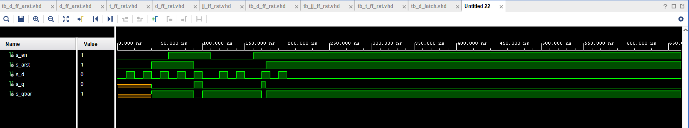
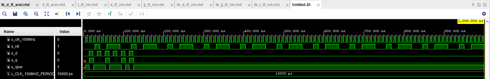
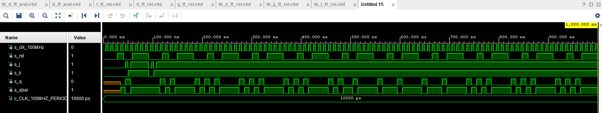
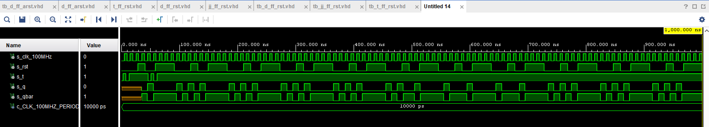

# 07-ffs
## 1.Preparation tasks (done before the lab at home). Submit
### Characteristic equations and completed tables for D, JK, T flip-flops.

   | **clk** | **d** | **q(n)** | **q(n+1)** | **Comments** |
   | :-: | :-: | :-: | :-: | :-- |
   |   | 0 | 0 | 0 | No change |
   |   | 0 | 1 | 0 | RESET |
   |   | 1 | 0 | 1 | No change |
   |   | 1 | 1 | 1 | SET |

   | **clk** | **j** | **k** | **q(n)** | **q(n+1)** | **Comments** |
   | :-: | :-: | :-: | :-: | :-: | :-- |
   |   | 0 | 0 | 0 | 0 | No change |
   |   | 0 | 0 | 1 | 1 | No change |
   |   | 0 | 0 | 1 | 0 | RESET |
   |   | 0 | 1 | 1 | 0 | RESET |
   |   | 1 | 0 | 0 | 1 | SET |
   |   | 1 | 0 | 1 | 1 | SET |
   |   | 1 | 1 | 0 | 1 | TOGGLE |
   |   | 1 | 1 | 1 | 0 | TOGGLE |

   | **clk** | **t** | **q(n)** | **q(n+1)** | **Comments** |
   | :-: | :-: | :-: | :-: | :-- |
   |   | 0 | 0 | 0 | No change |
   |   | 0 | 1 | 1 | No Change |
   |   | 1 | 0 | 1 | INVERT (Toggle) |
   |   | 1 | 1 | 0 | INVERT (Toggle) |

## 2.D latch. Submit
### VHDL code listing of the process p_d_latch with syntax highlighting
```vhdl
p_d_latch : process (d, arst, en)
begin
    if (arst='1') then
        q     <= '0';
        q_bar <= '1';
    elsif (en ='1') then
       q      <= d; 
       q_bar  <= not d;
    end if;
  end process p_d_latch;
```
### Listing of VHDL reset and stimulus processes from the testbench tb_d_latch.vhd file with syntax highlighting and asserts
```vhdl
   p_reset_gen : process
 begin
     s_arst <= '0';
     wait for 40 ns;
     
     -- Reset activated
     s_arst <= '1';
     wait for 50 ns;

     --Reset deactivated
     s_arst <= '0';
     wait for 85 ns;
     
     s_arst <= '1';
     wait;
 end process p_reset_gen;

--------------------------------------------------------------------
-- Data generation process
--------------------------------------------------------------------
p_stimulus : process
begin
    report "Stimulus process started" severity note;
    
    s_d  <= '0';
    s_en <= '0';
    
    --d sekv (en <= '0')
    wait for 10 ns;
    s_d  <= '1';
    wait for 10 ns;
    s_d  <= '0';
    wait for 5 ns;
assert(s_q = '0' and s_qbar = '1')
    report "Chyba" severity error;
    wait for 5 ns;
    s_d  <= '1';
    wait for 10 ns;
    s_d  <= '0';
    wait for 10 ns;
    s_d  <= '1';
    wait for 10 ns; 
    
    s_d  <= '0';
    s_en <= '1';
    
    --d sekv (en <= '1')
    wait for 10 ns;
    s_d  <= '1';
    wait for 10 ns;
    s_d  <= '0';
    wait for 10 ns;
    s_d  <= '1';
    wait for 10 ns;
    s_d  <= '0';
    wait for 10 ns;  
    
    s_d  <= '0';
    s_en <= '0';
    
    --d sekv (en <= '0')
    wait for 10 ns;
    s_d  <= '1';
  
    wait for 10 ns;
    s_d  <= '0';
    wait for 10 ns;
    s_d  <= '1';
    wait for 10 ns;
    s_d  <= '0';
    wait for 10 ns;
    
    s_d  <= '0';
    s_en <= '1';
    
    --d sekv (en <= '1')
    wait for 10 ns;
  
    s_d  <= '1';
    wait for 6 ns;
 
    wait for 4 ns;
    s_d  <= '0';
    wait for 10 ns;
    s_d  <= '1';
    wait for 10 ns;
    s_d  <= '0';
    wait for 10 ns;

    report "Stimulus process finished" severity note;
    wait;
end process p_stimulus;
```
### Screenshot with simulated time waveforms; always display all inputs and outputs. The full functionality of the entity must be verified.

## 3.Flip-flops. Submit:
### VHDL code listing of the processes p_d_ff_arst, p_d_ff_rst, p_jk_ff_rst, p_t_ff_rst with syntax highlighting
#### p_d_ff_arst
```vhdl
p_d_ff_arst : process (arst, clk)
begin
    if (arst='1') then
        q     <= '0';
        q_bar <= '1';
        
       --pokud je arst v 0 a je vzestupná hrana 
    elsif (rising_edge(clk)) then
       q      <= d; 
       q_bar  <= not d;
    end if;
  end process p_d_ff_arst;
```
#### p_d_ff_rst
```vhdl
p_d_ff_rst : process (clk, rst)
 begin
        if rising_edge(clk) then
            if (rst = '1') then
                q     <= '0';
                q_bar <= '1';
            
            else
                q     <= d;
                q_bar <= not d;
            
            end if;
        end if;
  end process p_d_ff_rst
```
#### p_jk_ff_rst
```vhdl
p_d_jk_rst : process (clk)
begin
       --pokud je arst v 0 a je vzestupná hrana 
    if (rising_edge(clk)) then
        if (rst = '1') then
            s_q <= '0';
        else
            if (j='0' and k='0' ) then
                s_q <= s_q;
            elsif (j='0' and k='1') then
                s_q <= '0';
            elsif (j='1' and k='0') then
                s_q <= '1';
            elsif (j='1' and k='1') then
                s_q <= not s_q;
               
            end if;
        
        end if;   
    end if;
  end process p_d_jk_rst;
```
#### p_t_ff_rst
p_t_ff_rst : process (clk)
begin
       --pokud je arst v 0 a je vzestupná hrana 
    if (rising_edge(clk)) then
        if (rst = '1') then
            s_q <= '0';
        
        elsif (t='1') then
              s_q <= not s_q;
               
        end if;
        
     end if;   
    
  end process p_t_ff_rst;
  
  q     <= s_q;
  q_bar <= not s_q;
```
### Listing of VHDL clock, reset and stimulus processes from the testbench files with syntax highlighting and asserts
#### tb_d_ff_arst
```vhdl
p_clk_gen : process
begin
    while now < 40 ms loop
        s_clk_100MHz <= '0';
        wait for c_CLK_100MHZ_PERIOD / 2;
        s_clk_100MHz <= '1';
        wait for c_CLK_100MHZ_PERIOD / 2;
    end loop;
    wait;
end process p_clk_gen;

--------------------------------------------------------------------
-- Reset generation process
--------------------------------------------------------------------
p_reset_gen : process
begin
    s_rst<= '0';
    wait for 28 ns;
    
    -- Reset activated
    s_rst <= '1';
    wait for 13 ns;

    s_rst <= '0';
    wait for 17 ns;
    
    s_rst <= '1';
    wait for 33 ns;
    
    s_rst <= '1';
    
end process p_reset_gen;

--------------------------------------------------------------------
-- Data generation process
--------------------------------------------------------------------
p_stimulus : process
begin
    report "Stimulus process started" severity note;   
    
    s_t <= '0';

    wait for 3 ns;
    s_t <= '1';
    wait for 2 ns;

    wait for 3 ns;
    s_t <= '0';
    wait for 2 ns;
       
    wait for 3 ns;
    s_t <= '1';
    wait for 3 ns;
    
    wait for 30 ns;
    s_t <= '0';
    wait for 5 ns;
    s_t <= '1';
    wait for 5 ns;
    s_t <= '0';
    wait for 5 ns;
    s_t <= '1';
    
    report "Stimulus process finished" severity note;
    wait;
end process p_stimulus;
```
#### tb_d_ff_rst
```vhdl
p_clk_gen : process
begin
    while now < 40 ms loop
        s_clk_100MHz <= '0';
        wait for c_CLK_100MHZ_PERIOD / 2;
        s_clk_100MHz <= '1';
        wait for c_CLK_100MHZ_PERIOD / 2;
    end loop;
    wait;
end process p_clk_gen;

--------------------------------------------------------------------
-- Reset generation process
--------------------------------------------------------------------
p_reset_gen : process
begin
    s_rst <= '0';
    wait for 28 ns;
    
    -- Reset activated
    s_rst <= '1';
    wait for 13 ns;

    s_rst <= '0';
    wait for 17 ns;
    
    s_rst <= '1';
    wait for 33 ns;
    
    s_rst <= '1';
    
    
end process p_reset_gen;
--------------------------------------------------------------------
-- Data generation process
--------------------------------------------------------------------
p_stimulus : process
begin
    report "Stimulus process started" severity note;

    s_d <= '0';
    
    wait for 14 ns;
    s_d <= '1';
    wait for 5 ns;

    wait for 5 ns; 
    s_d <= '0';

    wait for 10 ns;
    
    s_d <= '1';
    wait for 10 ns;
    s_d <= '0';
    wait for 10 ns;
    s_d <= '1';
    wait for 10 ns;
    s_d <= '0';
    
    wait for 10 ns;
    s_d <= '1';
    
    wait for 10 ns;
    s_d <= '0';
    
    wait for 10 ns;
    s_d <= '1';
    
    wait for 10 ns;
    s_d <= '0';
    
    wait for 10 ns;
    s_d <= '1';
    
    wait for 10 ns;
    s_d <= '0';

    report "Stimulus process finished" severity note;
    wait;
end process p_stimulus;

```
#### tb_jk_ff_rst
```vhdl
p_clk_gen : process
begin
    while now < 40 ms loop
        s_clk_100MHz <= '0';
        wait for c_CLK_100MHZ_PERIOD / 2;
        s_clk_100MHz <= '1';
        wait for c_CLK_100MHZ_PERIOD / 2;
    end loop;
    wait;
end process p_clk_gen;

--------------------------------------------------------------------
-- Reset generation process
--------------------------------------------------------------------
p_reset_gen : process
begin
    s_rst<= '0';
    wait for 28 ns;
    
    -- Reset activated
    s_rst <= '1';
    wait for 13 ns;

    s_rst <= '0';
    wait for 17 ns;
    
    s_rst <= '1';
    wait for 33 ns;
    
    s_rst <= '1';
    
    
end process p_reset_gen;
--------------------------------------------------------------------
-- Data generation process
--------------------------------------------------------------------
p_stimulus : process
begin
    report "Stimulus process started" severity note;

    s_j <= '0';
    s_k <= '0';
    
    wait for 40 ns;
    s_j <= '0';
    s_k <= '0';
    wait for 2 ns;
 
    wait for 3 ns;
    s_j <= '1';
    s_k <= '0';
    wait for 2 ns;
    
    wait for 3 ns;
    s_j <= '0';
    s_k <= '1';
    wait for 2 ns;
    
    wait for 3 ns;
    s_j <= '1';
    s_k <= '1';
    wait for 2 ns;
    
    wait for 35 ns;
    s_j <= '0';
    s_k <= '0';
    wait for 5 ns;
    
    s_j <= '1';
    s_k <= '0';
    wait for 5 ns;
    
    s_j <= '0';
    s_k <= '1';
    wait for 5 ns;
    
    s_j <= '1';
    s_k <= '1';

    report "Stimulus process finished" severity note;
    wait;
end process p_stimulus;

#### tb_t_ff_rst
p_clk_gen : process
begin
    while now < 40 ms loop
        s_clk_100MHz <= '0';
        wait for c_CLK_100MHZ_PERIOD / 2;
        s_clk_100MHz <= '1';
        wait for c_CLK_100MHZ_PERIOD / 2;
    end loop;
    wait;
end process p_clk_gen;

--------------------------------------------------------------------
-- Reset generation process
--------------------------------------------------------------------
p_reset_gen : process
begin
    s_rst<= '0';
    wait for 28 ns;
    
    -- Reset activated
    s_rst <= '1';
    wait for 13 ns;

    s_rst <= '0';
    wait for 17 ns;
    
    s_rst <= '1';
    wait for 33 ns;
    
    s_rst <= '1';
    
end process p_reset_gen;

--------------------------------------------------------------------
-- Data generation process
--------------------------------------------------------------------
p_stimulus : process
begin
    report "Stimulus process started" severity note;   
    
    s_t <= '0';

    wait for 3 ns;
    s_t <= '1';
    wait for 2 ns;

    wait for 3 ns;
    s_t <= '0';
    wait for 2 ns;
       
    wait for 3 ns;
    s_t <= '1';
    wait for 3 ns;
    
    wait for 30 ns;
    s_t <= '0';
    wait for 5 ns;
    s_t <= '1';
    wait for 5 ns;
    s_t <= '0';
    wait for 5 ns;
    s_t <= '1';
    
    report "Stimulus process finished" severity note;
    wait;
end process p_stimulus;
```
#### p_d_ff_arst
## Screenshot with simulated time waveforms; always display all inputs and outputs. The full functionality of the entities must be verified
#### p_d_ff_arst

#### d_ff_rst

#### jk_ff_rst

#### t_ff_rst

## 4.Shift register. Submit
### Image of the shift register schematic. The image can be drawn on a computer or by hand. Name all inputs, outputs, components and internal signals
