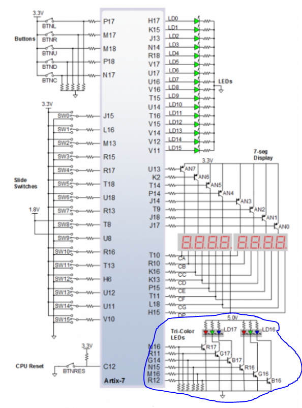
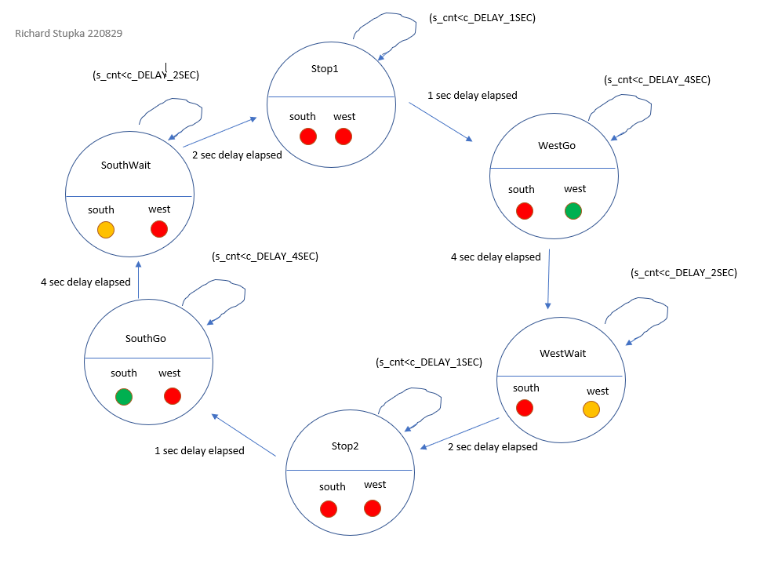
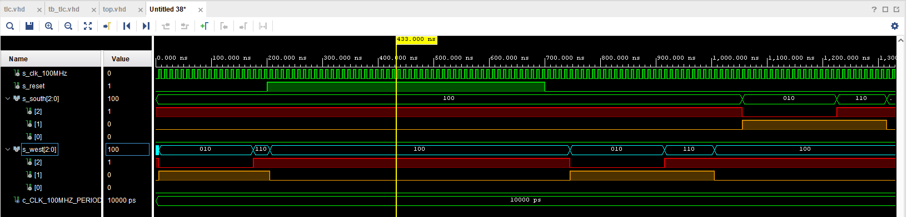
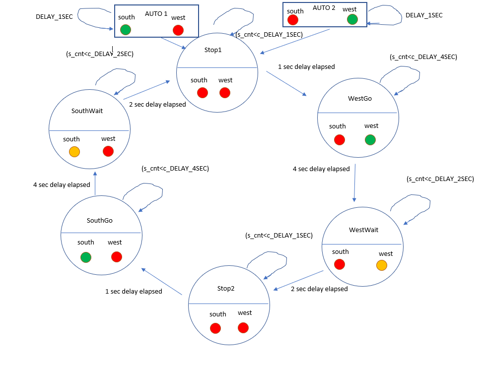

# 08-traffic_lights
## 1. Preparation tasks (done before the lab at home). Submit:
### State table,
| **Input P** | `0` | `0` | `1` | `1` | `0` | `1` | `0` | `1` | `1` | `1` | `1` | `0` | `0` | `1` | `1` | `1` |
| :-- | :-: | :-: | :-: | :-: | :-: | :-: | :-: | :-: | :-: | :-: | :-: | :-: | :-: | :-: | :-: | :-: |
| **State**    | A | A | B | C | C | D | A | B | C | D | B | B | B | C | D | B |
| **Output R** | `0` | 0 | 0 | 0 | 0 | 1 | 0 | 0 | 0 | 1 | 0 | 0 | 0 | 0 | 1 | 0 |
### RGB LEDs table.
| **RGB LED** | **Artix-7 pin names** | **Red** | **Yellow** | **Green** |
| :-: | :-: | :-: | :-: | :-: |
| LD16 | N15, M16, R12 | `1,0,0` | `1,1,0` | `0,1,0` |
| LD17 | N16, R11, G14 | `1,0,0` | `1,1,0` | `0,1,0` |


## 2. Traffic light controller. Submit:
### Listing of VHDL code of sequential process p_traffic_fsm with syntax highlighting
```vhdl
  p_traffic_fsm : process(clk)
    begin
        if rising_edge(clk) then
            if (reset = '1') then       -- Synchronous reset
                s_state <= STOP1 ;      -- Set initial state
                s_cnt   <= c_ZERO;      -- Clear all bits

            elsif (s_en = '1') then
                -- Every 250 ms, CASE checks the value of the s_state 
                -- variable and changes to the next state according 
                -- to the delay value.
                case s_state is

                    -- If the current state is STOP1, then wait 1 sec
                    -- and move to the next GO_WAIT state.
                    when STOP1 =>
                        -- Count up to c_DELAY_1SEC
                        if (s_cnt < c_DELAY_1SEC) then
                            s_cnt <= s_cnt + 1;
                        else
                            -- Move to the next state
                            s_state <= WEST_GO;
                            -- Reset local counter value
                            s_cnt   <= c_ZERO;
                        end if;

                    when WEST_GO =>
                        -- Count up to c_DELAY_4SEC
                        if (s_cnt < c_DELAY_4SEC) then
                            s_cnt <= s_cnt + 1;
                        else 
                            -- Move to the next state
                            s_state <= WEST_WAIT;
                            -- Reset local counter value 
                            s_cnt   <= c_ZERO;
                        end if;


                    when WEST_WAIT =>
                        -- Count up to c_DELAY_2SEC
                        if (s_cnt < c_DELAY_2SEC) then
                            s_cnt <= s_cnt + 1;
                        else 
                            -- Move to the next state
                            s_state <= STOP2;
                            -- Reset local counter value 
                            s_cnt   <= c_ZERO;
                        end if;


                    when STOP2 =>
                        -- Count up to c_DELAY_1SEC
                        if (s_cnt < c_DELAY_1SEC) then
                            s_cnt <= s_cnt + 1;
                        else 
                            -- Move to the next state
                            s_state <= SOUTH_GO;
                            -- Reset local counter value 
                            s_cnt   <= c_ZERO;
                        end if;
                        
                    when SOUTH_GO =>
                        -- Count up to c_DELAY_4SEC
                        if (s_cnt < c_DELAY_4SEC) then
                            s_cnt <= s_cnt + 1;
                        else 
                            -- Move to the next state
                            s_state <= SOUTH_WAIT;
                            -- Reset local counter value 
                            s_cnt   <= c_ZERO;
                        end if;
                        
                    when SOUTH_WAIT =>
                        -- Count up to c_DELAY_4SEC
                        if (s_cnt < c_DELAY_2SEC) then
                            s_cnt <= s_cnt + 1;
                        else 
                            -- Move to the next state
                            s_state <= STOP1;
                            -- Reset local counter value 
                            s_cnt   <= c_ZERO;
                        end if;
                        
                    -- It is a good programming practice to use the 
                    -- OTHERS clause, even if all CASE choices have 
                    -- been made. 
                    when others =>
                        s_state <= STOP1;

                end case;
            end if; -- Synchronous reset
        end if; -- Rising edge
    end process p_traffic_fsm;
```
### Listing of VHDL code of combinatorial process p_output_fsm with syntax highlighting
```vhdl
 p_output_fsm : process(s_state)
    begin
        case s_state is
            when STOP1 =>
                south_o <= c_RED;
                west_o  <= c_RED;
            when WEST_GO =>
                south_o <= c_RED;
                west_o  <= c_GREEN;                
            when WEST_WAIT =>
                south_o <= c_RED;
                west_o  <= c_YELLOW;  
            when STOP2 =>
                south_o <= c_RED;
                west_o  <= c_RED;  
            when SOUTH_GO =>
                south_o <= c_GREEN;
                west_o  <= c_RED;  
            when SOUTH_WAIT =>
                south_o <= c_YELLOW;
                west_o  <= c_RED;  
            when others =>
                south_o <= c_RED;
                west_o  <= c_RED;
        end case;
    end process p_output_fsm;
```
### Screenshot(s) of the simulation, from which it is clear that controller works correctly.

## 3. Smart controller. Submit:
### State table

| **Current state** | **Direction South** | **Direction West** | **Delay** |
| :-- | :-: | :-: | :-: |
| `AUTO1`      | green    | red | 1 sec |
| `AUTO2`      | red    | green | 1 sec |
| `STOP1`      | red    | red | 1 sec |
| `WEST_GO`    | red    | green | 4 sec |
| `WEST_WAIT`  | red    | yellow | 2 sec |
| `STOP2`      | red    | red | 1 sec |
| `SOUTH_GO`   | green  | red | 4 sec |
| `SOUTH_WAIT` | yellow | red | 2 sec |
### State diagram

### Listing of VHDL code of sequential process p_smart_traffic_fsm with syntax highlighting.
```vhdl
 p_smart_traffic_fsm : process(clk)
    begin
   
   if rising_edge(clk) then
            if (reset = '1') then       -- Synchronous reset
                s_state2 <= STOP1 ;      -- Set initial state
                s_cnt   <= c_ZERO;      -- Clear all bits
                
               
                 
        

            elsif (s_en = '1') then
                -- Every 250 ms, CASE checks the value of the s_state 
                -- variable and changes to the next state according 
                -- to the delay value.
                 if (autos1 = '1') then
                 s_state2 <= AUTO1 ;
                 s_cnt   <= c_ZERO; 
                 
                 end if;
                 
                 if (autos2 = '1') then
                 s_state2 <= AUTO2 ;
                 --s_cnt   <= c_ZERO; 
                 end if;
                
                case s_state2 is

                        when AUTO1 =>
                     -- Count up to c_DELAY_1SEC
                        if (s_cnt < c_DELAY_1SEC) then
                            s_cnt <= s_cnt + 1;
                        else
                            -- Move to the next state
                            s_state2 <= STOP1;
                            -- Reset local counter value
                            s_cnt   <= c_ZERO;
                        end if;
                       --end case; 

                     --case s_state2 is
                         when AUTO2 =>
                     -- Count up to c_DELAY_1SEC
                        if (s_cnt < c_DELAY_1SEC) then
                            s_cnt <= s_cnt + 1;
                        else
                            -- Move to the next state
                            s_state2 <= STOP1;
                            -- Reset local counter value
                            s_cnt   <= c_ZERO;
                        end if;
                        
                       
                
                
                 
                    -- If the current state is STOP1, then wait 1 sec
                    -- and move to the next GO_WAIT state.
                    when STOP1 =>
                        -- Count up to c_DELAY_1SEC
                        if (s_cnt < c_DELAY_1SEC) then
                            s_cnt <= s_cnt + 1;
                        else
                            -- Move to the next state
                            s_state2 <= WEST_GO;
                            -- Reset local counter value
                            s_cnt   <= c_ZERO;
                        end if;

                    when WEST_GO =>
                     -- Count up to c_DELAY_1SEC
                        if (s_cnt < c_DELAY_4SEC) then
                            s_cnt <= s_cnt + 1;
                        else
                            -- Move to the next state
                            s_state2 <= WEST_WAIT;
                            -- Reset local counter value
                            s_cnt   <= c_ZERO;
                        end if;
                        
                        
                         when WEST_WAIT =>
                     -- Count up to c_DELAY_1SEC
                        if (s_cnt < c_DELAY_2SEC) then
                            s_cnt <= s_cnt + 1;
                        else
                            -- Move to the next state
                            s_state2 <= STOP2;
                            -- Reset local counter value
                            s_cnt   <= c_ZERO;
                        end if;
                        
                        
                          when STOP2 =>
                     -- Count up to c_DELAY_1SEC
                        if (s_cnt < c_DELAY_1SEC) then
                            s_cnt <= s_cnt + 1;
                        else
                            -- Move to the next state
                            s_state2 <= SOUTH_GO;
                            -- Reset local counter value
                            s_cnt   <= c_ZERO;
                        end if;
                        
                        
                          when SOUTH_GO =>
                     -- Count up to c_DELAY_1SEC
                        if (s_cnt < c_DELAY_4SEC) then
                            s_cnt <= s_cnt + 1;
                        else
                            -- Move to the next state
                            s_state2 <= SOUTH_WAIT;
                            -- Reset local counter value
                            s_cnt   <= c_ZERO;
                        end if;
                        
                        
                             when SOUTH_WAIT =>
                     -- Count up to c_DELAY_1SEC
                        if (s_cnt < c_DELAY_2SEC) then
                            s_cnt <= s_cnt + 1;
                        else
                            -- Move to the next state
                            s_state2 <= STOP1;
                            -- Reset local counter value
                            s_cnt   <= c_ZERO;
                        end if;
                   
                    
                  
                       
                  end case;
                 -- end if;     
           
            
            end if;
  end if;

    --end if;
          
        -- Rising edge
    end process p_smart_traffic_fsm;
```
